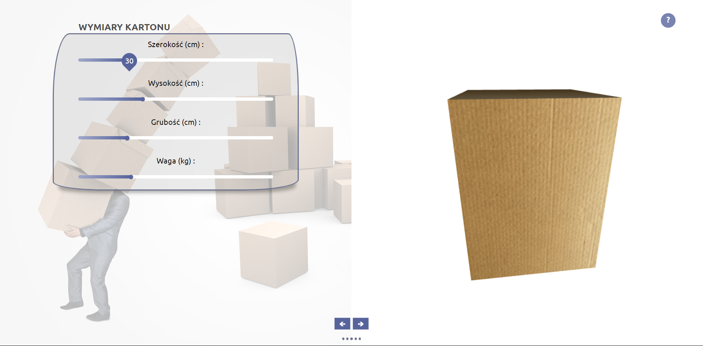

# Logistyk Kalkulator

Dokumentacja jest po polsku ponieważ pisane to było dla szkoły.

> Podgląd na żywo [_tutaj_](https://gh-pages--legendary-pasca-c3f919.netlify.app/#/).

## Spis treści

- [Ogólne informacje](#Ogólne-informacje)
- [Używane technologie](#Używane-technologie)
- [Stosowanie](#Stosowanie)
- [Jak tego użyć](#jak-tego-użyć)
- [Status projektu](#status-projektu)
- [Kontakt](#kontakt)
<!-- * [License](#license) -->

## Ogólne informacje

- Projekt powstał by ułatwić obliczenia klasie o profilu logistycznym.
- Wylicza i prezentuje ile i jak należy ustawić kartony na palecie i palety na naczepie by zmieściło ich się jak najwięcej, zachowując podane kryteria.
- Prawie wszystkie kryteria są nadawane przez użytkownika, poza ogólnym zamysłem by każde piętro było pełne.

## Używane technologie

- vue: ^2.6.11
- vue-router: ^3.5.3
- vuex: ^3.6.2
- three: ^0.135.0
- gh-pages: ^4.0.0
- core-js: ^3.6.5

## Stosowanie

**Pierwszy widok** daje możliwość wprowadzenia informacji o rozmiarze (cm) i wadze (kg) kartonu, oraz wizualizacje 3D.



**Drugi widok** daje możliwość wyboru palety z listy obowiązujących, oraz wizualizacje 3D.


**Trzeci widok** daje możliwość wprowadzenia innych niż podstawowe dane dotyczące palety, naczepy, czy włączenia/wyłączenia częściowo textur.


**Czwarty widok** oblicza informacje już o końcowej palecie. Od iloście kartonów po piętra czy w jaki sposób ułożyć pudełka by było ich jak najwięcej. Oraz wizualizuje w 3D.


**Piąty widok** oblicza informacje już o końcowej naczepie. Od łącznej ilości kartonów na niej po ilość palet kończąc jak najlepiej ułożyć palety. Oraz wizualizuje w 3D.


<!-- If you have screenshots you'd like to share, include them here. -->

## Jak tego użyć

Aby sklonować i uruchomić tę aplikację, potrzebujesz [Git](https://git-scm.com) i [Node.js](https://nodejs.org/en/download/) (który jest dostarczany z [ npm](http://npmjs.com)) zainstalowany na Twoim komputerze. Z wiersza poleceń:

```bash
# Klonowanie repozytorium
$ git clone https://github.com/Maty2002v2/projekt-logistyk.git

#Wejdź do folderu repozytorium
$ cd projekt-logistyk

#Wejdź do folderu aplikacji
$ cd my-app

# Zainstaluj zależności
$ npm install

# Uruchom aplikację
$ npm run serve
```

## Status projektu

Project is: _in progress_

## Kontakt

Stworzone przez [@Maty](mailto:mateusz_malolepszy_02@wp.pl) - nie wahaj się ze mną skontaktować!

<!-- Optional -->
<!-- ## License -->
<!-- This project is open source and available under the [... License](). -->

<!-- You don't have to include all sections - just the one's relevant to your project -->
